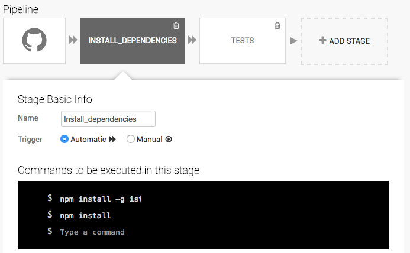

# Node.js - Test Driven Development - Continuous Integration

Travis CI | Circle CI | Snap CI | Coveralls
--- | --- | ---| --- |
 |  |  | 

A simple template project for getting started with Node.js, TDD and CI.
This  template will be using a wide of Continuous Integration services and test frameworks. It's up to you, to decide which services / frameworks fits your needs. Eg. you might come from a .Net / Java background and used to use Assert's in unit tests. Then it would make sense to use that kind of syntax while writting tests. Same goes for CI services. You might like to have an YML file describing how the build should be run. Perhaps you like a graphic tool with stages.

I have created this template for mainly new Node developers, to get a quick overview of some of the most used and up to date options. While also includeing some base samples for getting it up and running. This template will also help new developers how to structure code in Node.js  
This is by no means "This is the only way to structure code" template. Simply the way I choose to structure thing's.  

Further reading / discusions regarding Node.js Code structure:  
* http://stackoverflow.com/questions/5178334/folder-structure-for-a-node-js-project 
* https://gist.github.com/lancejpollard/1398757
* https://strongloop.com/strongblog/modular-node-js-express/
* Whatever you can find on google about this subject.

Furthermore this is not a guide of how to do Test Driven Development. Rather a template to enableing Test Driven Developemt. By showing how to continuously run test while writeing code or new tests. This template also contains a few different styles for writting tests. 

Well enough jibber jabber. Lets get started.

## Getting started

To get started and run example test code, simply install mocha and istanbul like so:  
(This script will install both globaly, which means you can use them in all project.)

~~~
$ npm install --global mocha
$ npm install -g istanbul
$ npm install
~~~

Running all the tests in the tests folder and keep watching them for changes.
~~~ 
$ mocha tests --recursive --watch
~~~

Creating coverage report for all tests in the tests folder
~~~
$ istanbul cover ./node_modules/mocha/bin/_mocha -- tests --recursive
~~~

## ESLint NEW!!
Created a new section for ESLint. Best described on [ESLint](http://eslint.org/) own page:

>ESLint is an open source JavaScript linting utility originally created by Nicholas C. Zakas in June 2013. Code linting is a type of static analysis that is frequently used to find problematic patterns or code that doesn’t adhere to certain style guidelines. There are code linters for most programming languages, and compilers sometimes incorporate linting into the compilation process.
>
>JavaScript, being a dynamic and loosely-typed language, is especially prone to developer error. Without the benefit of a compilation process, JavaScript code is typically executed in order to find syntax or other errors. Linting tools like ESLint allow developers to discover problems with their JavaScript code without executing it.

Getting started with installing and getting linting up and running in your project, it is importan to find out what kind of style, the project should be following. Try giving this artcicle ([10 Best JavaScript Style Guides Including Airbnb and Idiomatic](http://noeticforce.com/best-javascript-style-guide-for-maintainable-code)) a quick read. This should give you a idea about what might be a good way to go.

In Node-TDD-CI I have decided to go with [Airbnb code style](https://github.com/airbnb/javascript) after playing around. I started playing around with [standardjs](http://standardjs.com/). I had to give up after a short while playing around with it. It just wasn't me. The rule "No semicolons" was to far away from the way I am used to code. I want to stress, it's imporant to find a code style you and your team likes to follow. As mentioned I ended up choosing Airbnb. Below we can see how the template hello world express app used to look with Airbnb style rules enabled. ESLint marks "bad" code as errors / warnings depending on the style choosen. It doesn't mean the code didn't work as it were. Just it was bad practice and should be cleaned up.

After cleanup the code looks like:
~~~javascript
const version = require('./version.json');
const express = require('express');

const app = express();

app.get('/', (req, res) => {
  res.send(`Hello world from TopSwagCode! We are currently running version: ${version.version}`);
});

app.listen(80, () => {
  console.log('Example app listening on port 80!');
});
~~~

The main difference between the code now and before, is the use of ECMAScript 6. Some var's changed to const and function changed to arrow functions. I would recommend get started using linting, to ensure good code practices and consistent style thoughout a project.

## Testing
We have seen now we can run tests, recursively while keeping watch on them. Now it's time to create some new tests. ChaiJS has 3 styles / flavours out of the box. These 3 are: Should, Expect and Assert. Pick whatever you like the best or whatever makes the most sense your project. For quick overview see the three examples below (Examples taken from ChaiJS own homepage). For more in depth examples goto tests folder and see examples I've made.

### Should
~~~javascript
chai.should();

foo.should.be.a('string');
foo.should.equal('bar');
foo.should.have.length(3);
tea.should.have.property('flavors').with.length(3);
~~~

### Expect
~~~javascript
var expect = chai.expect;

expect(foo).to.be.a('string');
expect(foo).to.equal('bar');
expect(foo).to.have.length(3);
expect(tea).to.have.property('flavors').with.length(3);
~~~

### Assert
~~~javascript
var assert = chai.assert;

assert.typeOf(foo, 'string');
assert.equal(foo, 'bar');
assert.lengthOf(foo, 3)
assert.property(tea, 'flavors');
assert.lengthOf(tea.flavors, 3);
~~~

## Test Coverage

As stated before we can run istanbul for generating local test coverage reports. Something even more awesome is we can also share it online by using coveralls.io.
To get it up and running. add a new task withing the scripts section in package.json  
It should look similar to this:
~~~json
"scripts": {
    "test": "mocha test --recursive",
    "coveralls": "istanbul cover ./node_modules/mocha/bin/_mocha --report lcovonly -- -R spec && cat ./coverage/lcov.info | ./node_modules/coveralls/bin/coveralls.js && rm -rf ./coverage"
  }
~~~

Only thing left is to pick one of the Continuous Integration services for running and creating test coverage report.  
In this template I have choosen to go with Travic CI. For generating the report, I have added npm run-script coveralls tasks in my script sections within .travis.yml

~~~yml
script:
  - npm test
  - npm run-script coveralls
~~~

## Continuous Integration

### Circle CI

Circle CI setup is minimal. It has great support for Node.js out of the box. Only thing needed to get tests up and running is installing the test dependencies. Circle CI uses package.json down install all dependencies. It can even be overwritten to install dev dependencies. It also has support for running Node.js tests, if these are described in the package.json. I was able to get Circle CI up and running within a few minutes. It also seems Circle CI has support for skipping YML file and just typing every command on their website. Didn't try out this feature.

My minimal setup for running on Circle CI was simply to create a circle.yml file and adding the following lines: 

~~~yml
machine:
  node:
    version: 6.0.0
  pre:
    - npm install --global mocha
    - npm install -g istanbul
test:
  override:
    - mocha test --reporter mocha-junit-reporter:
        environment:
          MOCHA_FILE: $CIRCLE_TEST_REPORTS/junit/test-results.xml
~~~

Default Circle CI runs tests described in package.json. I have choosen to overide this basic behavior because I want to use Circle CI to generate a test report. By doing this I get nice test summary tab in Circle CI, which test are failing and with what values. I would also be able to download the entire report in the artifacts tab. Be low here we can see how failing tests looks like in Circle CI.

The test xml file, which can be downloaded looks like this:
~~~
<testsuite name="getSumPlusOne" timestamp="2016-10-28T09:43:56" tests="2" failures="0" time="0">
<testcase name="Mocha buildin assert suminator tests getSumPlusOne 2 + 2 + 1 should return 5" time="0" classname="2 + 2 + 1 should return 5"></testcase>
<testcase name="Mocha buildin assert suminator tests getSumPlusOne 2 + (-3) + 1 should return 0" time="0" classname="2 + (-3) + 1 should return 0"></testcase>
</testsuite>
~~~

### Travis CI

Travis is very similar to Circle CI. It also requires a YML file (.travis.yml) to get up and running. We have to specify in the YML we will be using Node.js and what version. Travis CI doesn't look at package.json. The result of this, is we have to have a few extra steps for installing dependencies and running tests. I simply added 3 statements in "install" part and added my test runner in "script" part. See my .travis.yml below: 

~~~yml
language: node_js

node_js:
  - "6"

sudo: true

env:
  - CI=true

install:
  - npm install --global mocha
  - npm install -g istanbul
  - npm install

script:
  - npm test
  - npm run-script coveralls
~~~

In travis it is easy to test different releases of Node.js. In my travis build both latests versions of 5 and 6 is getting run.

### Snap CI

Snap CI is unlike the two previous. It has only a graphical user interface. No YML nonesense. Simply create stages of commands, which will be your building steps. One cool feature is the options to add manual steps. I haven't tried this, but can see some opportunities. Eg. approving deployments to live setup and other cool stuff. Below here we can see my basic pipeline installing my dependencies. My pipeline consists of:
* Getting my code from github.
* Installing dependencies.
* Running tests.

Snap CI pipelines consists of "stages", which are the tasks we choose to run. When creating new stages, Snap CI has alot of prebuild which can easily be added and modified. See screenshot below.

At the moment Snap CI has some pretty basic stuff like npm, grunt and gulp. Furthermore they also have AWS and Heroku deployment stages.

# Project content
ESLint
* [Airbnb](https://github.com/airbnb/javascript)
* [Standardjs](http://standardjs.com)
* [ESLint](http://eslint.org/)

CI
* [Circle CI](https://circleci.com/)
* [Travis CI](https://travis-ci.org/) 
* [Snap CI](https://snap-ci.com/)

Test
* [Mocha Test framework](https://mochajs.org)
* [Chai // Syntax / style](http://chaijs.com/)
* [Istanbul // Test coverage reports](https://istanbul.js.org/)
* [coveralls.io // Online test coverage reports](https://coveralls.io/)

# Roadmap
* Add more CI services eg. Jenkins, https://dockbit.com/, https://codeship.com/, https://gitlab.com/
* Add dockerfile.
* Automatic deployments to Azure / AWS / Google App Engine.
* Create more realistic app with Express.
* Add some images / gifs for showcasing project.
* One button deploy. (Eg. from other repo).
* List of external great resources.
* table of content.

Have any great ideas for stuff this project could contain?  
Just mail me at josh@topswagcode.com  
Until next time, stay swag!

### Extra swag  
All code written in:  
https://code.visualstudio.com/ 